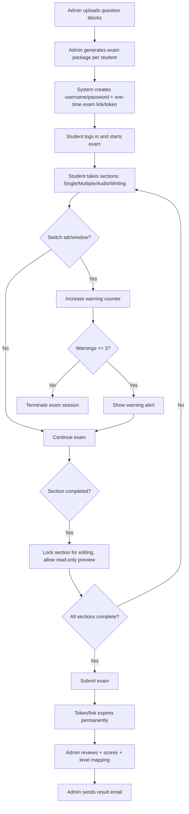
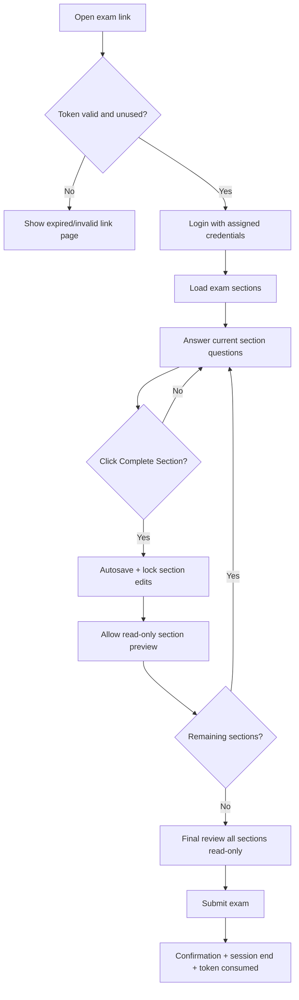
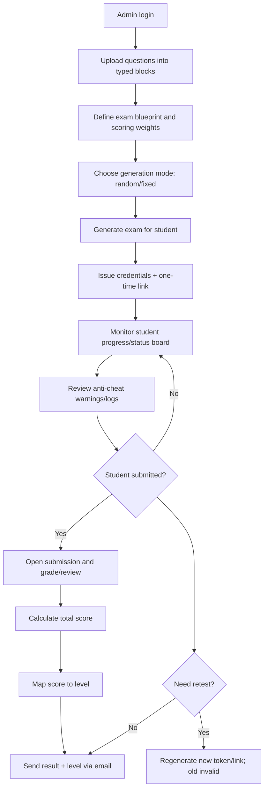

# Online Exam System Flowchart & Functional Document

## 1) Scope
This document defines the end-to-end flow for an online exam platform with two roles:
- **Student (Stu)**: take exams only.
- **Admin (AD)**: create/manage exams, monitor integrity, review, and publish results.

---

## 2) Actors and Permissions

## Student
- Login with username/password and exam link/token.
- Take exam sections:
  - Single Choose
  - Multiple Choose
  - Audio
  - Writing
- Receive anti-cheat warnings if browser/tab is switched.
- Review answers by section after section completion (read-only for locked sections).
- Submit exam once all sections are completed.

## Admin
- Upload/manage question blocks by type:
  - Single Choose Block
  - Multiple Choose Block
  - Audio Block
  - Writing Block
- Generate or re-generate a unique exam set for each student.
- Configure whether exam sequence is:
  - Fully randomized per student, or
  - Fixed step-by-step section order.
- Manage exam links:
  - One-time usable
  - Expires immediately after submission
  - Re-test requires admin to generate a new link
- Monitor live statuses:
  - Pending card block (waiting for review)
  - Already checking
  - Completed/graded
- Review scores and map levels:
  - Beginner
  - Pre-Intermediate
  - Intermediate
  - Pre-Advanced
  - Advanced
- Check anti-cheat logs.
- Send final result + level by email.

---

## 3) Key Business Rules

1. **Role constraint**
   - Student role can only access exam-taking features.
   - Admin role can only access management/review/configuration features.

2. **Tab switch detection and enforcement**
   - System tracks tab/window blur/focus events.
   - Show warning alerts for the first 3 violations.
   - On 4th violation, terminate exam session automatically.

3. **Section structure**
   - Exam contains 4 sections: Single, Multiple, Audio, Writing.
   - Student must complete sections based on configured mode:
     - **Fixed mode**: section N+1 unlocks after section N is completed.
     - **Random mode**: question order randomized within sections; section order may remain fixed.

4. **Section lock after completion**
   - Once student clicks **Complete Section**, that section becomes locked for editing.
   - Student can still preview/review completed sections in **read-only mode**.
   - Final submission includes all last-saved answers.

5. **Submission and link expiry**
   - After successful submission:
     - exam token marked as consumed,
     - exam link cannot be opened again,
     - any reattempt requires admin-generated new token/link.

6. **Question generation**
   - Admin clicks Generate Q/A to assign a unique exam package to a student.
   - Re-generate invalidates previous unsubmitted token (recommended behavior).

7. **Scoring and level mapping**
   - Total score is calculated from all sections.
   - System maps score to language level based on configurable ranges.

---

## 4) End-to-End Flowchart (High Level)

---

## 5) Student Exam Session Flow (Detailed)

---

## 6) Admin Management Flow (Detailed)

---

## 7) Data Model (Suggested)

## Core entities
- **User**(id, role, username, password_hash, status)
- **StudentProfile**(user_id, full_name, email)
- **ExamTemplate**(id, name, mode, section_config, scoring_rules)
- **QuestionBlock**(id, type, title, status)
- **Question**(id, block_id, type, content, options, answer_key, media_url)
- **ExamSession**(id, student_id, template_id, token, issued_at, expires_at, state)
- **ExamSectionAttempt**(id, session_id, section_type, started_at, completed_at, locked)
- **Answer**(id, attempt_id, question_id, response, is_final)
- **WarningLog**(id, session_id, event_type, timestamp, warning_count, action)
- **Submission**(id, session_id, submitted_at, total_score, level)
- **ResultEmailLog**(id, submission_id, sent_to, sent_at, delivery_status)

## Important states
- Session states: `issued`, `in_progress`, `terminated`, `submitted`, `expired`.
- Review states: `pending`, `checking`, `completed`.

---

## 8) API/Service Requirements (Suggested)

## Auth and session
- `POST /admin/login`
- `POST /student/login`
- `POST /exam/session/validate-token`

## Question management
- `POST /admin/question-blocks`
- `POST /admin/questions`
- `GET /admin/question-blocks`

## Generation and assignment
- `POST /admin/exams/generate`
- `POST /admin/exams/regenerate`
- `POST /admin/exams/invalidate-link`

## Exam taking
- `GET /student/exam/:sessionId`
- `POST /student/exam/:sessionId/answers/save`
- `POST /student/exam/:sessionId/section/complete`
- `POST /student/exam/:sessionId/warning`
- `POST /student/exam/:sessionId/submit`

## Review and results
- `GET /admin/submissions`
- `GET /admin/submissions/:id`
- `POST /admin/submissions/:id/grade`
- `POST /admin/submissions/:id/send-result`

---

## 9) Anti-Cheat Logic (Pseudo Rules)

1. On browser/tab switch event:
   - `warning_count += 1`
2. If `warning_count <= 3`:
   - show warning popup with remaining attempts.
3. If `warning_count > 3`:
   - auto-submit (optional) or terminate as policy,
   - mark session `terminated`,
   - lock further access.

---

## 10) UX Notes

- Display section progress clearly: `Section 2 of 4`.
- Before student clicks **Complete Section**, show confirmation:
  - “After completion, this section is locked for editing. You can still preview in read-only mode.”
- Show warning banner persistently after each tab-switch incident.
- Final submission requires explicit confirmation.

---

## 11) Acceptance Criteria (Sample)

1. Student receives exactly 3 warning popups; 4th violation ends session.
2. Completed sections are not editable.
3. Student can preview all completed sections before final submit.
4. Submitted exam link cannot be reused.
5. Admin can regenerate a new exam link for retest.
6. Admin can review submissions and assign level from total score.
7. Result email is sent and logged.

---

## 12) Open Decision Points

1. On 4th warning: terminate immediately or auto-submit current answers?
2. Randomization policy: random by section only or across entire exam?
3. Retest policy: retain history under same student profile or create new attempt group?
4. Audio/Writing grading: fully manual, fully auto, or hybrid?
5. Level thresholds: fixed defaults or configurable per exam template?

